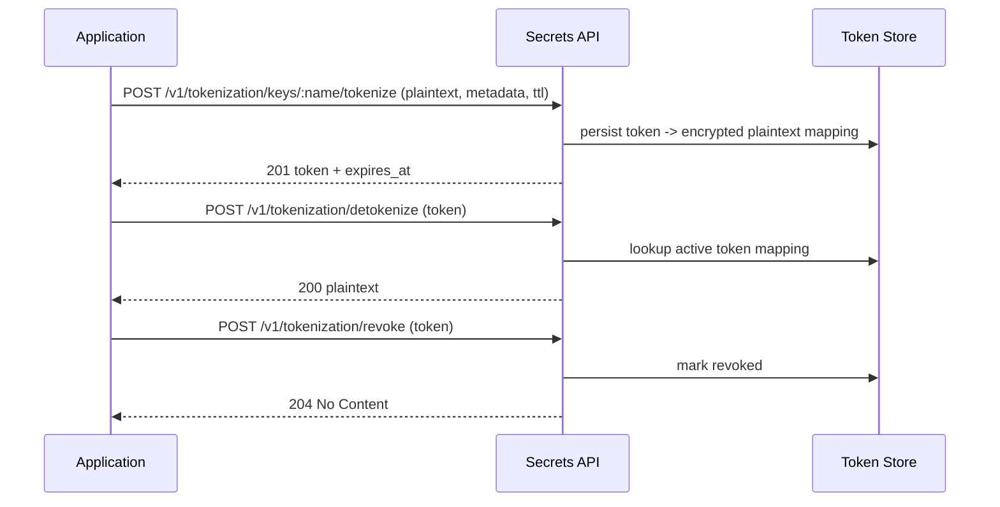
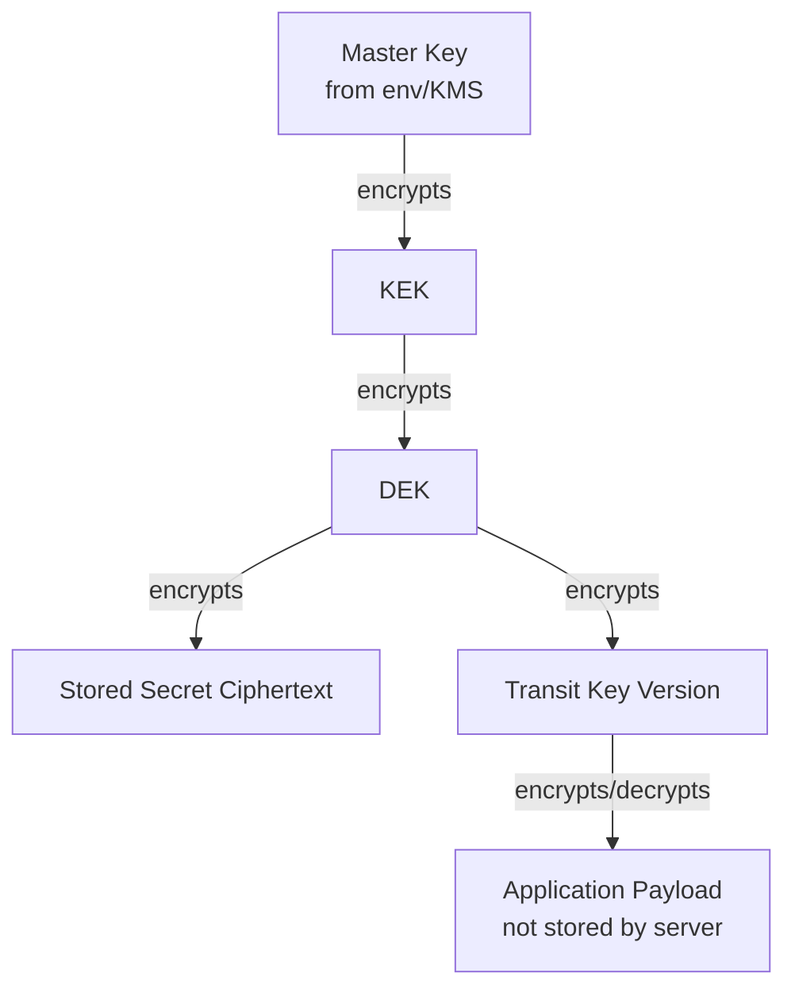

# 🏗️ Architecture

> Last updated: 2026-02-18

Secrets follows Clean Architecture with domain-driven boundaries so cryptographic rules stay isolated from transport and storage concerns.

## 🔐 Envelope encryption model

```text
Master Key -> KEK -> DEK -> Secret Data
```

- `Master Key`: root of trust loaded from environment/KMS
- `KEK`: key-encryption key, encrypted with the active master key
- `DEK`: data-encryption key, generated per secret version
- `Secret Data`: ciphertext persisted in the database

## 🚄 Transit encryption model

```text
Master Key -> KEK -> DEK -> Transit Key -> Application Data
```

Transit mode is encryption-as-a-service: Secrets returns ciphertext/plaintext to the caller and does not persist application payloads.

## 🎫 Tokenization model

```text
Master Key -> KEK -> DEK -> Tokenization Key -> Token <-> Encrypted Plaintext Mapping
```

Tokenization mode persists a token mapping. The server stores encrypted plaintext and returns tokens
that can later be detokenized, validated, revoked, and expired.

Tokenization request lifecycle:



## 🤔 Secrets API vs Transit API

Use this quick rule:

- Use Secrets API when Secrets should store and version ciphertext by path
- Use Transit API when your application stores payloads and only needs encrypt/decrypt operations

| Need | Choose | Why |
| --- | --- | --- |
| Centralized secret storage at `/v1/secrets/*path` | Secrets API | Server persists encrypted data and versions it |
| Encrypt/decrypt service without storing payloads | Transit API | Server returns crypto result only; payload storage remains in your app |
| Format-preserving tokens with lifecycle controls | Tokenization API | Server persists token mapping and supports detokenize/validate/revoke |
| Secret version history by path | Secrets API | Versioning is built into secret writes |
| Key version rotation for stateless crypto operations | Transit API | Transit keys rotate independently while old versions can still decrypt |

## 🧩 Data and flow diagram



## 🧱 Layer responsibilities

- `domain/`: business entities and invariants (`Client`, `Token`, `Secret`, `TransitKey`, `TokenizationKey`, `Kek`, `Dek`)
- `usecase/`: orchestration, transactional boundaries, and policy decisions
- `repository/`: PostgreSQL/MySQL persistence and query logic
- `service/`: reusable technical services (crypto, token hashing, helpers)
- `http/`: Gin handlers, DTO validation, middleware, and error mapping

## ✅ Why this design works

- 🔄 Rotate keys without bulk re-encryption of all historical data
- 🔒 Isolate versions cryptographically using independent DEKs
- 🧪 Keep use cases testable with mockable interfaces
- 🌐 Expose consistent HTTP contracts while preserving domain purity

## See also

- [Security model](security-model.md)
- [Key management operations](../operations/key-management.md)
- [Environment variables](../configuration/environment-variables.md)
- [Secrets API](../api/secrets.md)
- [Tokenization API](../api/tokenization.md)
- [ADR 0001: Envelope Encryption Model](../adr/0001-envelope-encryption-model.md)
- [ADR 0002: Transit Versioned Ciphertext Contract](../adr/0002-transit-versioned-ciphertext-contract.md)
