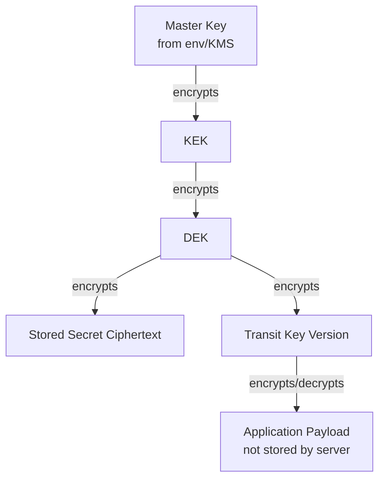

# 🏗️ Architecture

> Last updated: 2026-02-14

Secrets follows Clean Architecture with domain-driven boundaries so cryptographic rules stay isolated from transport and storage concerns.

## 🔐 Envelope encryption model

```text
Master Key -> KEK -> DEK -> Secret Data
```

- `Master Key`: root of trust loaded from environment/KMS
- `KEK`: key-encryption key, encrypted with the active master key
- `DEK`: data-encryption key, generated per secret version
- `Secret Data`: ciphertext persisted in the database

## 🚄 Transit encryption model

```text
Master Key -> KEK -> DEK -> Transit Key -> Application Data
```

Transit mode is encryption-as-a-service: Secrets returns ciphertext/plaintext to the caller and does not persist application payloads.

## 🧩 Data and flow diagram



## 🧱 Layer responsibilities

- `domain/`: business entities and invariants (`Client`, `Token`, `Secret`, `TransitKey`, `Kek`, `Dek`)
- `usecase/`: orchestration, transactional boundaries, and policy decisions
- `repository/`: PostgreSQL/MySQL persistence and query logic
- `service/`: reusable technical services (crypto, token hashing, helpers)
- `http/`: Gin handlers, DTO validation, middleware, and error mapping

## ✅ Why this design works

- 🔄 Rotate keys without bulk re-encryption of all historical data
- 🔒 Isolate versions cryptographically using independent DEKs
- 🧪 Keep use cases testable with mockable interfaces
- 🌐 Expose consistent HTTP contracts while preserving domain purity

## See also

- [Security model](security-model.md)
- [Key management operations](../operations/key-management.md)
- [Environment variables](../configuration/environment-variables.md)
- [Secrets API](../api/secrets.md)
