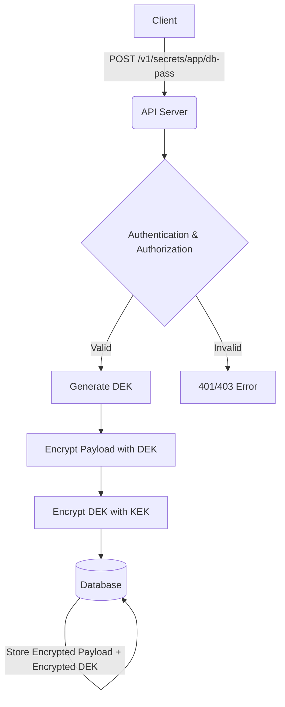

# 📦 Secret Engine

The Secret Engine provides versioned storage for sensitive data, secured using envelope encryption.

## How it works

Secrets are encrypted before being stored in the database. The system uses a hierarchy of keys:

1. **Master Key**: Used to encrypt the Key Encryption Key (KEK).
2. **KEK**: Used to encrypt the Data Encryption Key (DEK).
3. **DEK**: Used to encrypt the actual secret payload.



## Endpoints

All endpoints require `Authorization: Bearer <token>`.

### Create or Update Secret

- **Endpoint**: `POST /v1/secrets/*path`
- **Capability**: `encrypt`
- **Body**: `{"value": "base64-encoded-string"}`
- **Success**: `201 Created`

```bash
curl -X POST http://localhost:8080/v1/secrets/app/prod/database-password 
  -H "Authorization: Bearer <token>" 
  -H "Content-Type: application/json" 
  -d '{"value":"bXktc3VwZXItc2VjcmV0LXBhc3N3b3Jk"}'
```

Example response (`201 Created`):

```json
{
  "id": "0194f4a5-73fe-7a7d-a3a0-6fbe9b5ef8f3",
  "path": "app/prod/database-password",
  "version": 3,
  "created_at": "2026-02-27T18:22:00Z"
}
```

### Read Secret

- **Endpoint**: `GET /v1/secrets/*path`
- **Capability**: `decrypt`
- **Query Params**: `?version=X` (optional)
- **Success**: `200 OK`

```bash
curl http://localhost:8080/v1/secrets/app/prod/database-password 
  -H "Authorization: Bearer <token>"
```

Example response (`200 OK`):

```json
{
  "id": "0194f4a5-73fe-7a7d-a3a0-6fbe9b5ef8f3",
  "path": "app/prod/database-password",
  "version": 3,
  "value": "YjY0LXBsYWludGV4dA==",
  "created_at": "2026-02-27T18:22:00Z"
}
```

### List Secrets

- **Endpoint**: `GET /v1/secrets`
- **Capability**: `read`
- **Query Params**:
  - `after_path` (optional) - Cursor for pagination. Omit for first page.
  - `limit` (default 50, max 1000) - Number of items per page.
- **Success**: `200 OK` (Does not return secret values)

```bash
# First page
curl "http://localhost:8080/v1/secrets?limit=50" \
  -H "Authorization: Bearer <token>"

# Subsequent pages (use next_cursor from previous response)
curl "http://localhost:8080/v1/secrets?after_path=app/prod/db&limit=50" \
  -H "Authorization: Bearer <token>"
```

Example response (`200 OK`):

```json
{
  "data": [
    {
      "id": "0194f4a5-73fe-7a7d-a3a0-6fbe9b5ef8f3",
      "path": "app/prod/database-password",
      "version": 3,
      "created_at": "2026-02-27T18:22:00Z"
    },
    {
      "id": "0194f4b2-91ab-7c3d-b5e1-8adc2f6ea4c9",
      "path": "app/prod/redis-password",
      "version": 1,
      "created_at": "2026-02-27T19:15:00Z"
    }
  ],
  "next_cursor": "app/prod/redis-password"
}
```

**Note**: The `next_cursor` field is only present when there are more pages available. When it's absent, you've reached the last page.

### Delete Secret

- **Endpoint**: `DELETE /v1/secrets/*path`
- **Capability**: `delete`
- **Success**: `204 No Content` (Soft delete)

```bash
curl -X DELETE http://localhost:8080/v1/secrets/app/prod/database-password 
  -H "Authorization: Bearer <token>"
```

## Relevant CLI Commands

- `rewrap-deks`: Rewraps all DEKs using the active KEK. Used during key rotation.

  ```bash
  ./bin/app rewrap-deks
  ```
