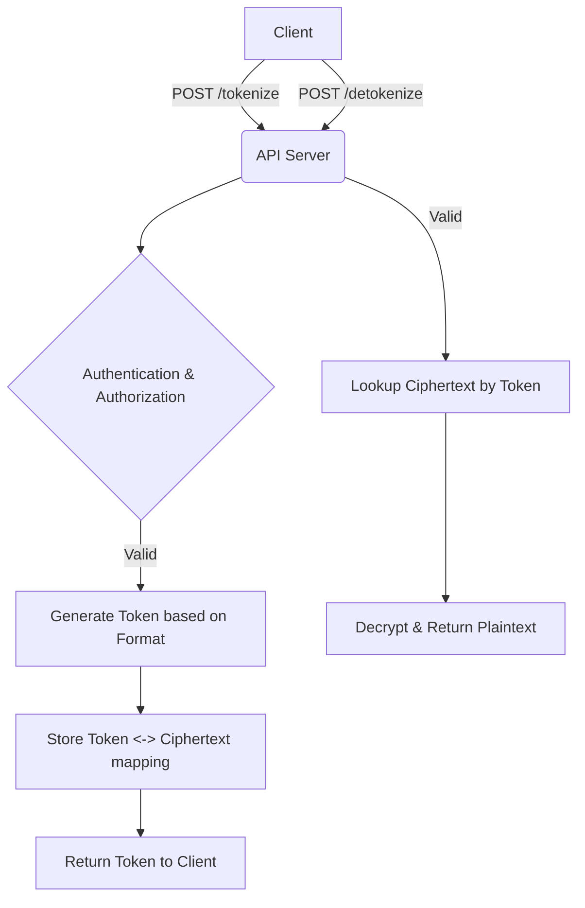

# 🎫 Tokenization Engine

The Tokenization API provides format-preserving token generation for sensitive values, with optional deterministic behavior and token lifecycle management.

## How it works

Tokenization replaces sensitive data (like a credit card number) with a non-sensitive substitute, known as a token. The engine handles the generation, mapping, storage, and detokenization of these values.



## Endpoints

All endpoints require `Authorization: Bearer <token>`.

### Create Tokenization Key

- **Endpoint**: `POST /v1/tokenization/keys`
- **Capability**: `write`
- **Body**: `name`, `format_type` (`uuid`, `numeric`, `luhn-preserving`, `alphanumeric`), `is_deterministic`, `algorithm`.

```bash
curl -X POST http://localhost:8080/v1/tokenization/keys 
  -H "Authorization: Bearer <token>" 
  -H "Content-Type: application/json" 
  -d '{
    "name": "payment-cards",
    "format_type": "luhn-preserving",
    "is_deterministic": true,
    "algorithm": "aes-gcm"
  }'
```

### Rotate Tokenization Key

- **Endpoint**: `POST /v1/tokenization/keys/:name/rotate`
- **Capability**: `rotate`

### Tokenize Data

- **Endpoint**: `POST /v1/tokenization/keys/:name/tokenize`
- **Capability**: `encrypt`
- **Body**: `plaintext` (base64), `metadata` (optional object), `ttl` (optional seconds).

```bash
curl -X POST http://localhost:8080/v1/tokenization/keys/payment-cards/tokenize 
  -H "Authorization: Bearer <token>" 
  -H "Content-Type: application/json" 
  -d '{
    "plaintext": "NDUzMjAxNTExMjgzMDM2Ng==",
    "metadata": { "last_four": "0366" }
  }'
```

Example response (`201 Created`):

```json
{
  "token": "4532015112830366",
  "metadata": {
    "last_four": "0366"
  },
  "created_at": "2026-02-27T10:35:00Z",
  "expires_at": "2026-02-27T11:35:00Z"
}
```

### Detokenize Data

- **Endpoint**: `POST /v1/tokenization/detokenize`
- **Capability**: `decrypt`
- **Body**: `{"token": "string"}`

Example response (`200 OK`):

```json
{
  "plaintext": "NDUzMjAxNTExMjgzMDM2Ng==",
  "metadata": {
    "last_four": "0366"
  }
}
```

### Validate and Revoke

- `POST /v1/tokenization/validate` (Capability: `read`) - Check if token is valid without returning plaintext.
- `POST /v1/tokenization/revoke` (Capability: `delete`) - Marks a token as revoked.

### List and Delete Keys

- `GET /v1/tokenization/keys` (Capability: `read`)
- `DELETE /v1/tokenization/keys/:id` (Capability: `delete`)

## Deterministic Tokenization

When `is_deterministic` is set to `true`, the engine ensures that the same plaintext value always produces the same token *under the same key version*.

- **Security**: To prevent rainbow table attacks, each key version generates a unique random 32-byte salt. The engine uses HMAC-SHA256 with this salt to compute a unique hash for each plaintext.
- **Equality Matching**: This mode allows for equality matching and duplicate detection within your application without exposing the sensitive plaintext.
- **Rotation**: When a key is rotated, a new salt is generated. Identical plaintext tokenized under the new version will produce a different token than the previous version.

## Relevant CLI Commands

- `rewrap-deks`: Rewraps tokenization key DEKs when rotating the KEK.
