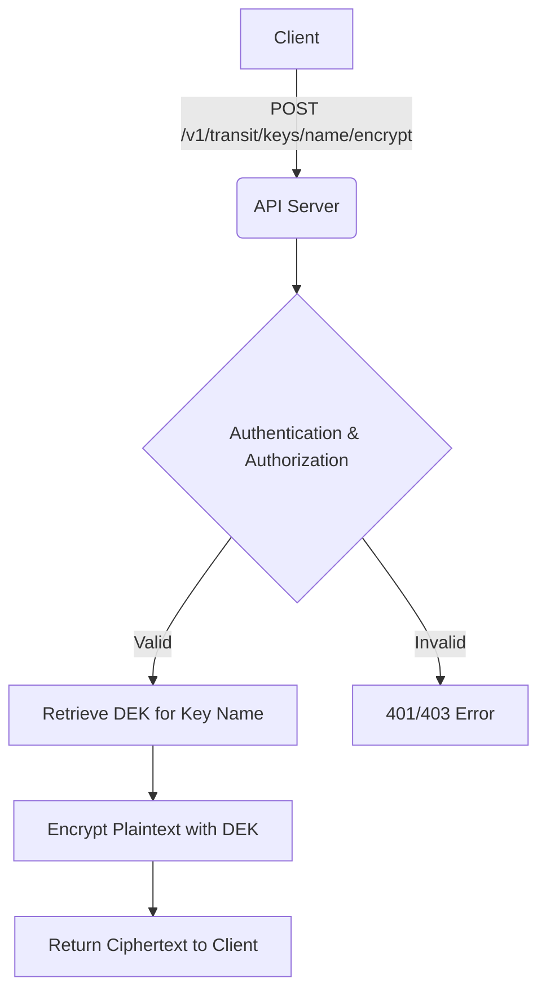

# 🚄 Transit Engine

The Transit API encrypts and decrypts data in transit without storing the application payload. It offers Encryption as a Service (EaaS).

## How it works

The transit engine generates a Data Encryption Key (DEK) for each transit key created. The API then uses this DEK to encrypt or decrypt data provided by the client, returning the ciphertext or plaintext directly. The system handles DEK management, versioning, and rotation automatically.



## Endpoints

All endpoints require `Authorization: Bearer <token>`.

### Create Transit Key

Creates the initial transit key version (`version = 1`).

- **Endpoint**: `POST /v1/transit/keys`
- **Capability**: `write`
- **Body**: `{"name": "string", "algorithm": "aes-gcm" | "chacha20-poly1305"}`

```bash
curl -X POST http://localhost:8080/v1/transit/keys 
  -H "Authorization: Bearer <token>" 
  -H "Content-Type: application/json" 
  -d '{"name":"payment-data","algorithm":"aes-gcm"}'
```

### Rotate Transit Key

Creates a new active version for encryption while old versions remain valid for decryption.

- **Endpoint**: `POST /v1/transit/keys/:name/rotate`
- **Capability**: `rotate`
- **Body**: `{"algorithm": "aes-gcm" | "chacha20-poly1305"}`

### Encrypt Data

- **Endpoint**: `POST /v1/transit/keys/:name/encrypt`
- **Capability**: `encrypt`
- **Body**: `{"plaintext": "base64-encoded-string"}`

```bash
curl -X POST http://localhost:8080/v1/transit/keys/payment-data/encrypt 
  -H "Authorization: Bearer <token>" 
  -H "Content-Type: application/json" 
  -d '{"plaintext":"c2Vuc2l0aXZlLWRhdGE="}'
```

Returns:

```json
{
  "ciphertext": "1:ZW5jcnlwdGVkLWJ5dGVzLi4u",
  "version": 1
}
```

Example encrypt response (`200 OK`):

```json
{
  "ciphertext": "1:ZW5jcnlwdGVkLWJ5dGVzLi4u",
  "version": 1
}
```

### Decrypt Data

- **Endpoint**: `POST /v1/transit/keys/:name/decrypt`
- **Capability**: `decrypt`
- **Body**: `{"ciphertext": "1:ZW5jcnlwdGVkLWJ5dGVzLi4u"}`

```bash
curl -X POST http://localhost:8080/v1/transit/keys/payment-data/decrypt 
  -H "Authorization: Bearer <token>" 
  -H "Content-Type: application/json" 
  -d '{"ciphertext":"1:ZW5jcnlwdGVkLi4u"}'
```

Example decrypt response (`200 OK`):

```json
{
  "plaintext": "YjY0LXBsYWludGV4dA==",
  "version": 1
}
```

### List and Delete Keys

#### List Transit Keys

- **Endpoint**: `GET /v1/transit/keys`
- **Capability**: `read`
- **Query Params**:
  - `after_name` (optional) - Cursor for pagination. Omit for first page.
  - `limit` (default 50, max 1000) - Number of items per page.
- **Success**: `200 OK`

```bash
# First page
curl "http://localhost:8080/v1/transit/keys?limit=50" \
  -H "Authorization: Bearer <token>"

# Subsequent pages (use next_cursor from previous response)
curl "http://localhost:8080/v1/transit/keys?after_name=main-encryption&limit=50" \
  -H "Authorization: Bearer <token>"
```

Example response (`200 OK`):

```json
{
  "data": [
    {
      "id": "0194f4e1-c3ab-7d8e-a9f2-5cde3b8fa6c1",
      "name": "app-encryption",
      "algorithm": "aes256-gcm96",
      "version": 3,
      "created_at": "2026-02-27T22:00:00Z",
      "updated_at": "2026-02-28T12:00:00Z"
    },
    {
      "id": "0194f4f2-d5bc-7a1f-b8c3-6def4c9eb7d2",
      "name": "main-encryption",
      "algorithm": "chacha20-poly1305",
      "version": 1,
      "created_at": "2026-02-27T23:15:00Z",
      "updated_at": "2026-02-27T23:15:00Z"
    }
  ],
  "next_cursor": "main-encryption"
}
```

**Note**: The `next_cursor` field is only present when there are more pages available.

#### Delete Transit Key

- **Endpoint**: `DELETE /v1/transit/keys/:name`
- **Capability**: `delete`
- **Success**: `204 No Content`

## Relevant CLI Commands

- `rewrap-deks`: Rewraps transit key DEKs when rotating the KEK.
