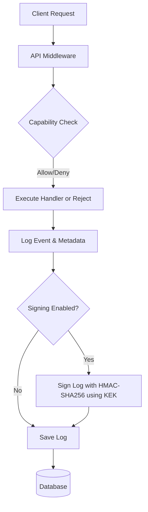

# 📜 Audit Logs

Audit logs capture capability checks and access attempts for monitoring and compliance.

## How it works

Every authenticated request that interacts with resources protected by a capability check generates an audit log entry. The system uses a middleware to asynchronously record these logs in the database. Logs can be cryptographically signed to ensure tamper resistance.



## Endpoints

### List Audit Logs

- **Endpoint**: `GET /v1/audit-logs`
- **Capability**: `read`
- **Query Params**:
  - `offset` (default 0)
  - `limit` (default 50, max 100)
  - `created_at_from` (RFC3339)
  - `created_at_to` (RFC3339)

```bash
curl "http://localhost:8080/v1/audit-logs?created_at_from=2026-02-27T00:00:00Z&limit=20" 
  -H "Authorization: Bearer <token>"
```

### Signature Fields (v0.9.0+)

- `signature`: HMAC-SHA256 signature for tamper detection.
- `kek_id`: References KEK used for signing.
- `is_signed`: `true` for signed logs.

## Relevant CLI Commands

- `verify-audit-logs`: Verifies cryptographic integrity of signed logs.

  ```bash
  ./bin/app verify-audit-logs --start-date "2026-02-27" --end-date "2026-02-28"
  ```

- `clean-audit-logs`: Deletes old records by retention days.

  ```bash
  ./bin/app clean-audit-logs --days 90
  ```
